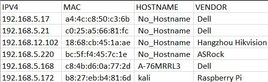
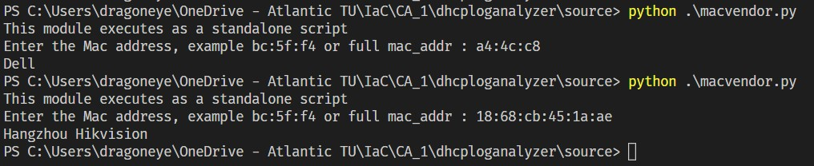

# Python DHCPD Log Analyzer

>A simple Python script to read a dhcpd log and get host details

## Description

Python script to read a dhcpd log and write IP Address, unique Mac,Hostname and Mac Vendor in a CSV file



## Getting Started

### Tested on

* Python version 3.10.7
* Windows 11 64bit


### Executing program

* Program can be run by executing the main.py
* dest_file variable can be changed
* Destination file is saved in current working directory
* Destination file name is nodes.csv

```
dest_file = "./nodes.csv"
```
* There is a standalone program inside the source folder called macvendor which can be executed directly and giving a mac address as input



## Documentation

* A brief description of the functions used in program is in docs folder of the project

## Authors

Abilash venu  
L00170962@atu.ie

## Version History

* 0.2
    * Various bug fixes and optimizations
* 0.1
    * Initial Release

## Acknowledgments

Inspiration, Thanks !
* [JOR](https://github.com/GreatlyImprovedTechnology)