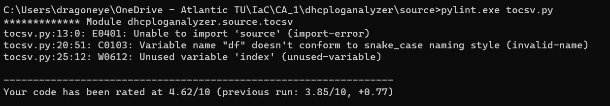

# Introduction

>A simple Python script to read a dhcpd log and write IP Address, unique Mac,Hostname and Mac Vendor in a CSV file.

## Functionality

The main program is splited into four functions

* readlog
* dhcpack
* macvendor
* tocsv

### Function readlog

* This function reads the dhcpd log file line by line and and split it into list of values called dhcpack_values
* These values are passed into dhcpack function
* And return the final hosts_list from the dhcpack function

### Function dhcpack

* This function first passes the values from readlog and createan empty list to append the appropriate values
* Find the vendor from macvendor function and append it to vendor list and return a zipped list of contents ipv4, mac, node, vendor

### function macvendor

* This function can be run as a standalone program as well to find the vendor according to the values listed in the tuple
* The tuple values can be added for future use comma seperated
* The return value is passed to the dhcpack function

### function tocsv

* This function write the final hosts_lists to the csv file using the csv module
* Destination file can be changed accordingly to the user discretion

## Unit Testing

* Unit testing can be done with the python program named testfuction.py placed in source folder
* Uncomment the import module as mentioned in the code for the proper functioning.

* Important functions are tested and output is below

## Pylint

* Below is the pylint score for the program

## ToDo

* Some functions can't be tested using unit testing because of module import error

## Authors

Abilash venu  
L00170962@atu.ie

## Acknowledgments

Inspiration, Thanks !
* [JOR](https://github.com/GreatlyImprovedTechnology)